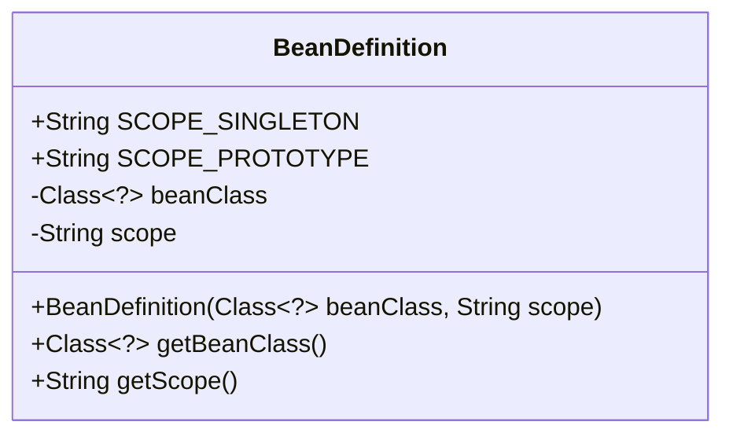
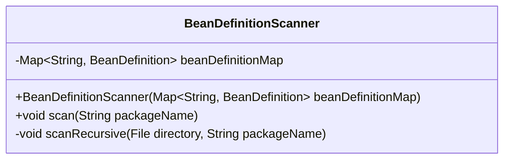

# Java 활용 능력 데모

이 데모 리포지토리는 여러 프로젝트로 구성되어 있으며, 목차는 다음과 같습니다.

[1. Spring Boot IoC 컨테이너 및 컴포넌트 스캔 구현](#1-spring-boot-ioc-컨테이너-및-컴포넌트-스캔-구현)  
[2. TODO](#2-todo)

## 1. Spring Boot IoC 컨테이너 및 컴포넌트 스캔 구현

프로젝트 경로: `projects/ioc`

[**Spring Boot**](https://spring.io/projects/spring-boot)는 대부분의 실무자가 백엔드 개발에 사용하는 **자바** 프레임워크입니다.
스프링 부트 생태계는 견고하고 확장 가능한 솔루션을 구축하는 데 적합합니다.
따라서 스프링 부트에 대한 깊은 이해는 실무 능력과 직결됩니다.

이 프로젝트는 스프링 부트 활용에 앞서 핵심 원리에 대한 이해를 보여주는 것을 목표로 합니다.
자바의 어노테이션과 리플렉션을 활용하여 스프링 부트의 **IoC 컨테이너**와 **컴포넌트 스캔**을 직접 구현했습니다.

### 주요 클래스 설명

#### BeanDefinition

`BeanDefinition` 클래스는 Spring Bean (이하 빈) 정의를 나타내는 역할입니다. 이 구현에서 빈 정의는 빈 클래스와 스코프를 갖습니다. 빈 클래스는 빈 객체가 될 자바 클래스입니다. 스코프는 빈 객체의 생명주기의 범위를 의미합니다. 스코프는
싱글턴과 프로토타입 두 가지가 있습니다.

싱글턴 스코프 빈은 아래 소개할 `ApplicationContext`와 생명주기 범위가 같습니다. `ApplicationContext` 객체의 `getBean(Class<?> beanClass)` 메서드를 호출하면 같은 빈을 반환합니다. 반면에 프로토타입 스코프 빈은 새로운 빈을 생성해 반환합니다. 프로토타입 스코프 빈의 생명주기는 전적으로 호출자에게 달려있습니다.

##### BeanDefinition 클래스 다이어그램



#### BeanDefinitionScanner

`BeanDefinitionScanner` 클래스는 자바 클래스 로더를 사용해 특정 패키지 내 클래스들의 `@Component`, `@Scope` 어노테이션을 재귀적으로 검사하고 `beanDefinitionMap`에 `BeanDefinition` 객체를 추가하는 역할입니다.

예를 들어 아래와 같이 `FooController`에 `@Controller` 어노테이션을 추가할 경우 `Controller` 어노테이션은

```java
// src/test/java/com/harryplusplus/ioc/testapp/foo/FooController.java
@Controller
public class FooController { /* 구현 */ }

// src/main/java/com/harryplusplus/ioc/Controller.java
@Component
public @interface Controller {}

// src/main/java/com/harryplusplus/ioc/Component.java
public @interface Component {}
```

##### BeanDefinitionScanner 클래스 다이어그램



## 2. TODO
